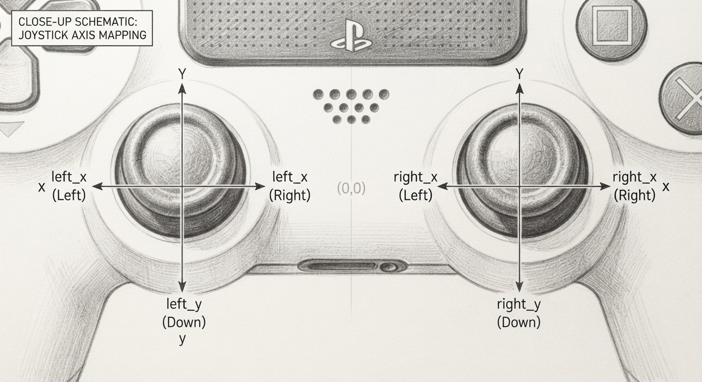

**In this project you drive the robot with the two thumbsticks. One stick runs the left wheel. The other runs the right wheel.**

> {{SAVE}}

# Part 1: How it works

Read this part when you get stuck. It has the answer to almost every question you will have.

## What is already in your p03.py file

Your file comes with the setup lines, the loop, and the shutdown line. The three `# WORK` blocks are empty.

You fill them by typing the code out of Part 2 by hand, the same way you did in P01 and P02. Thonny still does the indenting.

## How tank drive steers

A car steers with a steering wheel. A tank does not. A tank has a motor on each side, and it turns by running one side faster than the other.

Your tank drive robot works the same way.

- Both sticks forward, and it goes straight.
- Push the left stick further than the right, and it curves right.
- Left stick forward, right stick back, and it spins in place.

Nothing in your code will say the word "turn." A turn is just two wheels doing different things.

## Reading the gamepad joysticks

The gamepad has two joysticks named left and right:



The joysticks have four variables in the gamepad: `left_y`, `left_x`, `right_y`, `right_x`. As you can see in the picture, the `_x` variables go side to side and the `_y` variables go up and down.

Your file already has a loop that reads the gamepad controller:

```
while not (sb.held('cancel') or gamepad.held('options')):
    gamepad.update()
```

`gamepad.update()` asks the controller what it is doing right now. You need to ask every time through the loop.

After the update the gamepad tells you where the left stick and the right stick are:

```
gamepad.left_y     # the left stick
gamepad.right_y    # the right stick
```

These variables use the numbers from -1.0 to +1.0 to tell you how far the stick was pushed.

- `0.0`: The stick is in the center. Nobody is touching it.
- `+1.0`: The stick is all the way up (for `_y`) or all the way right (for `_x`).
- `-1.0`: The stick is all the way down (for `_y`) or all the way left (for `_x`).
- `0.5`: The stick is halfway up or halfway right.
- `-0.5`: The stick is halfway down or halfway left.

Having the sticks report a number between -1 and 1 tells you a lot about where they are, but we will see that we have to work with those numbers to make them useful.

## Printing the stick values using the SuperBot

You cannot see inside a running robot. There is no way to know what `gamepad.left_y` is right now by staring at the robot. The SuperBot has a power for that named `log_info()`:

```
sb.log_info(gamepad.left_y)
```

Whatever you hand it gets printed in Thonny. Push the left stick about halfway forward and that line prints:

```
0.51
```

Hand it two values and you get both, side by side:

```
sb.log_info(gamepad.left_y, gamepad.right_y)
```

```
0.51 -0.23
```

That is the third power you have used, after `sb.held()` and `sb.light_both_leds()`.

## One press, one reading

Now try to use it. Put `sb.log_info()` into the loop like this:

```
sb.log_info(gamepad.left_y, gamepad.right_y)
```

Every trip through the loop prints a line, and the loop runs about fifty times a second, so you see a lot of numbers:

```
0.0 0.0
0.0 0.0
0.0 0.0
... fifty more of these, every second
```

The numbers scroll past faster than you can read them.

Let's control the printing with a button. We will only print when you press the X on the gamepad. We use `gamepad.held('cross')` to check the button:

```
if gamepad.held('cross'):
    sb.log_info(gamepad.left_y, gamepad.right_y)
```

This is okay. If you hold the button down and move the stick you can see the numbers change. But you might want to print out only one line per button press.

We use a different gamepad function to do that. It is named `pressed()` because it is only True when the button has just been pressed. After it returns True once, it goes back to being False until you let go and push the button again.

You use `pressed()` the same way as `held()`:

```
if gamepad.pressed('cross'):
    sb.log_info(gamepad.left_y, gamepad.right_y)
```

## Turning stick numbers into wheel speeds

Say you push the left stick halfway, get +0.5, and use that as a speed for the wheels. The robot barely twitches.

Nothing is broken. The motors do not measure speed the way sticks do. Motors want RPM, which is rotations per minute, and you just asked for half a rotation a minute.

To turn a stick position into a wheel speed, we multiply the stick position by the wheel's top speed. The top speed is already in your file, in a variable named `MAX_RPM`:

```
target_rpm = stick_value * MAX_RPM
```

`MAX_RPM` is set to 70, which is as fast as these motors go. Push the stick halfway to +0.5 and you get 35 RPM. Push it all the way to +1.0 and you get the full 70.

Here is the nice part. The minus sign takes care of itself. Pull back to -1.0 and the math gives you -70, and a negative RPM means the wheel turns backward. You never write any code for reverse. It comes free.

## Sending the speeds to the wheels

One line drives both wheels:

```
alvik.set_wheels_speed(left_speed, right_speed)
```

Left first, right second.

Call it every time through the loop. The wheels keep doing whatever you told them last. Stop calling it and the robot keeps rolling.

## Cleaning up when there are motors

You met `finally` in P01. Code inside it always runs. Normal ending, crash, or Stop button.

It matters more now. In P01 a crash left your lights stuck on, which is annoying. In this project a crash leaves the wheels spinning, and the robot drives itself off the table.

So the first thing in your cleanup is this:

```
alvik.brake()
```

That stops both motors.

There is one more thing to put right. Back at the top, when the gamepad connected, it turned both lights green to tell you so. Nothing in this project ever changes them again, so they are still green when you quit. Clear them with the power you met in P02:

```
sb.light_both_leds(0, 0, 0)
```

The last line, `alvik.stop()`, is already written for you. Leave it there. Both of your cleanup lines go above it.

# Part 2: Do the work

## Step 1: Set up

1. Turn on your Alvik robot.
2. Open `p03_gamepad_driving.py` in Thonny and save your own copy to the robot, as described at the top of this guide.
3. Run the program. Thonny prints your robot's WiFi name in the Shell.
4. Connect your Mac to that WiFi network. The password is `password`.
5. Open `http://192.168.4.1` in Chrome. Keep that Chrome window in front for the whole project. Chrome blocks gamepad input to any window that is not focused.
6. Pair your PS5 controller to the Mac over Bluetooth. The robot's LEDs turn green when it connects.
7. Put the robot on the floor. Not on a table.

## Step 2: Type in WORK 1

Look before you drive. These two lines print both stick values, once, each time you press X.

Find the `# WORK 1` comment and type them underneath it:

```
if gamepad.pressed('cross'):
    sb.log_info(gamepad.left_y, gamepad.right_y)
```

Run it. Push a stick all the way and press X. Push it halfway and press X. Let go and press X. Write all three readings down.

You should see the full push land near 1.0, the half push near 0.5, and the centered stick sit at exactly 0.0.

## Step 3: Type in WORK 2

Now the driving. Two lines of math, then one line that sends it.

Find the `# WORK 2` comment and type these underneath it:

```
left_speed = gamepad.left_y * MAX_RPM
right_speed = gamepad.right_y * MAX_RPM
alvik.set_wheels_speed(left_speed, right_speed)
```

Run it and drive. Straight, curving, spinning in place, backward. Your WORK 1 readings still print whenever you press X.

## Step 4: Type in WORK 3

This is the shutdown, and with motors it is the part that keeps your robot on the table.

Find the `# WORK 3` comment, inside `finally:`, and type these underneath it. They go above the `alvik.stop()` line that is already there:

```
alvik.brake()
sb.light_both_leds(0, 0, 0)
```

Test it by pressing Options while the robot is rolling. The wheels should stop right where they are.

## Step 5: Worksheet and check off

One run shows all of it. Press X a few times and read your numbers out of the Shell, then drive forward, back up, spin in place, and press Options to stop clean.

{{PARTA}}

{{GRADING}}

## FLEX: The A+

This one is not printed anywhere. You work it out.

Make each LED report on its own wheel.

- That wheel going forward: the LED on that side is green.
- That wheel going backward: red.
- That wheel stopped: white.

`sb.light_both_leds()` will not help you here. It sets both lights the same, and the whole point is that the two sides can disagree.
