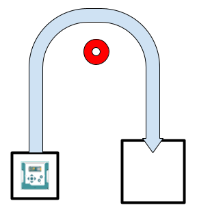

**In this project you drive a course. Out of the start box, around the cone, down the other side, and into the parking space — and the robot does the whole thing on its own.**

> {{SAVE}}

# Part 1: How it works

Read this part when you get stuck. It has the answer to almost every question you will have.

## The course



Your robot starts in the start box. It drives out, curves around the cone, comes back down the other side, and stops inside the parking space.

Three pieces: a straight, a curve, and another straight.

Look at where the two boxes are. They sit side by side, level with each other. That is going to matter at the very end of this guide.

## The zero you have already typed

In P04 you wrote this line:

```
alvik.drive(DRIVE_SPEED_CMS, 0)
```

I told you `drive()` takes a forward speed and a turning speed, and then we used the forward one and never touched the other. It was zero every single time, and zero turning is what makes the robot go straight.

This whole project is about that second number.

## Turning in place using drive()

Start at the other extreme. Put nothing in the first spot and something in the second:

```
alvik.drive(0, 45)
```

No forward speed, so the robot does not go anywhere. It stands where it is and turns.

The `45` is **degrees per second**. It is a speed, exactly like the first number is a speed. It does not say how far to turn — it says how fast to keep turning. At 45 degrees per second the robot goes all the way around in eight seconds, and then it keeps going, because nothing has told it to stop.

A positive number turns the robot to the left. A negative number turns it to the right.

```
alvik.drive(0, 45)     # turning left
alvik.drive(0, -45)    # turning right
```

## Driving and turning at the same time

Now put a real number in both spots:

```
alvik.drive(8, 30)
```

Eight centimeters a second forward, and 30 degrees a second of turning, at the same time. The robot rolls forward *while* it swings its nose around, and what it draws on the floor is a curve.

Here is every combination, spelled out:

- `alvik.drive(8, 0)` — forward, dead straight
- `alvik.drive(0, 30)` — turning left, going nowhere
- `alvik.drive(0, -30)` — turning right, going nowhere
- `alvik.drive(8, 30)` — forward and curving left
- `alvik.drive(8, -30)` — forward and curving right
- `alvik.drive(-8, 30)` — backwards, still turning left
- `alvik.drive(0, 0)` — nothing at all, which is what `alvik.brake()` really does

This is the one thing `drive()` can do that nothing else in the robot can. `alvik.move()` only goes straight. `alvik.rotate()` only turns in place. A curve needs both at once, and only `drive()` gives you both.

## Making the curve wider or tighter

The two numbers pull against each other. **Driving forward faster makes the curve wider. Turning faster makes it tighter.**

Think about one second of driving. The robot rolls forward 8 centimeters and swings its nose 30 degrees. Now go forward twice as fast. In that same second the robot covers 16 centimeters and *still* only swings 30 degrees, so it has travelled much further around a much bigger circle.

- `alvik.drive(8, 30)` — a curve about 15 centimeters from its center
- `alvik.drive(4, 30)` — half the speed, half the curve: about 8 centimeters
- `alvik.drive(8, 15)` — half the turning, twice the curve: about 30 centimeters

So there are two ways to make a curve tighter. Slow down, or turn harder.

## Both numbers come out of the same two motors

The wheels have a top speed. Going forward uses it up, and turning uses it up too, so you cannot ask for a lot of both at once. If the robot ever does something that makes no sense — barely turning when you asked for a hard turn — that is what happened. Make both numbers smaller.

## Working out your own speed

Every student drives at a different speed. Yours comes from your student number, so work it out before you go any further.

1. Multiply your number by 5.
2. If the answer is bigger than 40, subtract 41. Do that again if it is still bigger than 40.
3. Divide by 10.
4. Add 4.

Student 13 does this: 13 times 5 is 65. That is bigger than 40, so 65 minus 41 is 24. Then 24 divided by 10 is 2.4, and 2.4 plus 4 is **6.4**. Student 13 drives at 6.4 centimeters per second.

Everybody's answer comes out different. Nobody else's numbers will work for you, and yours will not work for them.

## Finding your numbers instead of working them out

You need four numbers: how long to drive out, how fast to turn, how long to stay in the turn, and how long to drive in.

You are not going to work these out on paper. You are going to guess, run it, watch what the robot does, and change the guess. Then do it again. That is not cheating and it is not giving up — it is how this is actually done, by everybody, including people who build robots for a living.

What to change when:

- Robot stops short of the cone — make the first time bigger.
- Robot swings out wide and misses the cone on the outside — turn faster.
- Robot cuts in tight and clips the cone — turn slower.
- Robot comes out of the curve still pointing sideways — more time in the curve.
- Robot comes around too far and points back at the cone — less time in the curve.
- Robot stops short of the box — make the last time bigger.

**Change one number at a time.** Change two and the robot will do something different, and you will have no idea which change did it.

## Stopping, and not stopping

`drive()` never stops on its own, and that turns out to be useful. You do **not** have to stop between the legs of the course. Calling `drive()` again just changes what the robot is doing right now — straight becomes curving, curving becomes straight — and the wheels never pause. Your robot flows around the course in one smooth trip.

One `alvik.brake()` at the very end stops it, and that line is already written for you.

# Part 2: Do the work

## Step 1: Set up

1. Turn on your Alvik robot and connect it to your Mac with the USB cable.
2. Open `p05_around_the_cone.py` in Thonny and save your own copy to the robot as described at the top of this guide. **Name it `p05.py`.**
3. In Thonny, open the robot's `main.py`. It is on the robot itself, not inside `workspace`.
4. Replace what is in it with this one line, and save:

```
import workspace.p05
```

5. Work out your own speed from your student number, the way Part 1 shows you, and type it into `MY_SPEED_CMS` at the top of your file.
6. Put the course board down with room around it, and stand the cone in its circle.

## Step 2: Type in WORK 1

Getting out of the start box.

First, add a number to the top of your file, on the line under `MY_SPEED_CMS`:

```
TIME_TO_CONE = 3.0
```

Three is a guess. It is supposed to be.

Now find the `# WORK 1` comment. Type these lines where the `pass` line is, then delete the `pass` line:

```
alvik.drive(MY_SPEED_CMS, 0)
time.sleep(TIME_TO_CONE)
```

Put the robot in the start box, turn it on, and press OK.

It drives straight out and stops. It stops because there is nothing else in the program yet, and the `alvik.brake()` at the bottom catches it.

Now change `TIME_TO_CONE` until the robot stops level with the cone. Bigger number, further out. You should have this one in two or three tries.

## Step 3: Type in WORK 2

The curve. This is the new part.

Add two more numbers at the top, under `TIME_TO_CONE`:

```
TURN_RATE_DEG_S = -30.0
TIME_TURNING = 6.0
```

Why negative? Look at the course. The robot goes up the left side and comes down the right, so it is turning to its **right** the whole way around, and right turns are negative.

Now find the `# WORK 2` comment and type these two lines underneath your WORK 1 lines, at the same indent:

```
alvik.drive(MY_SPEED_CMS, TURN_RATE_DEG_S)
time.sleep(TIME_TURNING)
```

Notice there is no `alvik.brake()` between the legs. The robot rolls straight out of the first leg and into the curve without ever stopping.

Two numbers to find here, and they do different jobs. Get them in this order.

**`TURN_RATE_DEG_S` sets how wide the curve is.** Robot swinging out too wide? Turn faster — make the number more negative. Cutting in too tight? Turn slower.

**`TIME_TURNING` sets how far around it goes.** Robot ends up still pointing sideways? More seconds. Turned too far and pointing back at the cone? Fewer seconds.

Width first, then how far around. When this leg is right, the robot ends up above the parking box, pointing straight down into it.

## Step 4: Type in WORK 3

Into the box.

Add the last number at the top:

```
TIME_BACK = 3.0
```

Find the `# WORK 3` comment and type these under your WORK 2 lines:

```
alvik.drive(MY_SPEED_CMS, 0)
time.sleep(TIME_BACK)
```

Zero in the second spot again, so this leg is dead straight, the same as the first one.

Tune it until the robot parks inside the lines.

Then run the whole course three more times without changing anything. Does it stop in the same place every time, or does it land somewhere new on every run? Whichever it does, that is worth knowing before you show it to anybody.

## Step 5: Worksheet and check off

One run shows everything. Put the robot in the start box, power it up with no cable, hold OK, and let it drive the whole course into the parking space on its own.

{{PARTA}}

{{GRADING}}

## FLEX: The A+

This one is not printed anywhere. You work it out.

Look at the course one more time. The parking box sits beside the start box, level with it. So the last leg of the trip is exactly as long as the first one — the robot drives out, comes around, and drives back the same distance it went.

Which means one of your four numbers is not really a mystery at all. The robot already measured it, on the way out, without being asked.

Make the last leg use that measurement instead of a number you tuned by hand. P04 has everything you need.
