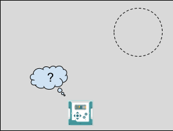
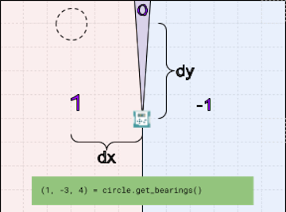

**In this project the robot hides an invisible ring on the floor. You have to find it with the gamepad — and the only help you get is the lights you build yourself.**

> {{SAVE}}

# Part 1: How it works

Read this part when you get stuck. It has the answer to almost every question you will have.

## The game



When your program starts, the robot picks a spot on the floor somewhere within a meter of itself and calls that the ring. The ring is 20 centimeters across — a bit more than two robot widths. Nothing is there. No tape, no cone, no circle drawn on the floor. It exists in the robot's head and nowhere else.

Your job is to drive the robot into it with the gamepad.

You cannot see the ring, so the robot has to tell you. That is the whole project: **you are not really writing code to find the ring. You are writing the thing that tells a person where it is.**

When the robot rolls inside the ring it stops, spins in place to celebrate, and hides a new one.

## What the robot has known all along

In P04 you wrote this line and I told you to ignore most of it:

```
distance_out, _, _ = alvik.get_pose()
```

Three numbers came back and you kept one. The two underscores threw away the other two.

Here is what you threw away. `get_pose()` reports **where the robot is**, not just how far it has gone:

- the first number is how far it is along one direction
- the second number is how far it is along the other direction
- the third number is which way it is pointing

Two numbers for a spot on the floor and one for a heading. That is enough to describe exactly where a robot is standing, and the robot has been keeping track of all three since P04. You just never asked.

`alvik.reset_pose(0, 0, 0)` still means what it meant: forget everything, you are standing at nothing, start counting from here.

## Meet the magic circle

Your file has a `Circle` class in it. You do not have to change a line of it, and you do not have to understand it to finish the project — but it is right there in your own file if you get curious, and there is no magic in it. Only arithmetic.

Two lines are already written for you. This one hides the ring:

```
circle = Circle(MAX_DIST_CM, RING_DIAMETER_CM)
```

And this one, inside the loop, asks about it:

```
dir, dx, dy = circle.get_bearings()
```

`get_bearings()` hands back three things at once, the same way `get_pose()` does. It is named `get_bearings()` because getting your bearings means working out where you are and which way to go.

Here is one robot, one ring, and everything `get_bearings()` would say about them:



## What dir tells you

`dir` is one number and it has exactly three possible values. The picture shows all three as areas around the robot:

- `1` means the ring is off to the robot's **left** — the whole shaded area on the left
- `-1` means the ring is off to the robot's **right** — the whole shaded area on the right
- `0` means the robot is **pointed straight at it** — the narrow slice running straight ahead

Look at how thin that middle slice is. It is not "roughly forwards," it is nearly straight ahead, and that is what makes it worth hunting for.

In the picture the ring is up and to the left, so `dir` is `1`.

That is the whole thing. `dir` never tells you how far off you are, only which way is wrong.

The `0` is the valuable one. Once the robot is pointed at the ring, going straight will take you there — so the game is: spin until you get a `0`, drive forward, and check again, because you will drift off and it will stop being `0`.

Notice what `dir` does *not* say. It will not tell you the ring is behind you. It cannot, with only three values. If the ring is behind the robot, `dir` sends you turning one way or the other, and you keep turning until you come around to it. That works out the same in the end.

## What dx and dy tell you

`dx` and `dy` are the last two, and the picture shows them as the two curly brackets. They are **the two short sides of a right triangle**, and the straight line from the robot to the ring is the long side.

In the picture, `get_bearings()` came back as `(1, -3, 4)`. So `dir` is `1`, `dx` is `-3`, and `dy` is `4`.

One of those is negative, and that is normal. `dx` and `dy` are measured along two fixed directions, so either one can come out negative depending on which side of the robot the ring landed on.

Do not try to work out left and right from them. They are not left and right, `dir` already told you that, and they will fool you if you try. **They are there to be squared.**

## Working out the distance

`get_bearings()` will not tell you how far away the ring is. It gives you the two short sides and stops.

You already know how to finish it. **The long side of a right triangle is the square root of the two short sides squared and added together.** In Python:

```
distance = math.sqrt(dx * dx + dy * dy)
```

`math.sqrt()` is the square root. It comes from the `math` toolbox, which your file already imports.

Try it on the numbers in the picture. `dx` is `-3` and `dy` is `4`:

- `-3` times `-3` is `9`. A negative times a negative is positive, so the minus sign disappears — which is exactly why nobody has to care which way `dx` was pointing.
- `4` times `4` is `16`.
- `9` plus `16` is `25`.
- The square root of `25` is `5`.

The ring is 5 centimeters away. Two numbers in, one number out, and the one that comes out is the truth about how far the robot has to go.

## Putting the distance on the screen

Your robot has a small screen, and the SuperBot can write three lines on it:

```
sb.update_display("Distance", str(round(distance)))
```

Two new pieces in that line.

`round()` chops the decimals off. `distance` comes out as something like `73.4192837`, and nobody needs that on a screen the size of a postage stamp. `round(73.4192837)` is `73`.

`str()` turns a number into text. The screen writes text, not numbers, so anything you send it has to be turned into text first.

Run it and you can already play, badly. Drive a little, squint at the screen, drive a little more.

## Why a number on a screen is not good enough

Try it. Really try it, before you write anything else.

You are standing across the room. The gamepad is in both hands. The screen is two centimeters wide, it is on top of the robot, and about half the time it is facing away from you. The robot is moving. And the one thing you need to know — *which way do I turn?* — is not on the screen at all.

The number is correct and it is useless.

This is the actual job of this project, and it is a job real engineers spend their whole careers on. You have information. The person needs to *act* on it. Between those two things somebody has to design a way to say it — a light, a beep, a needle, a color — that the person can read in a fraction of a second without stopping to think.

You have three lights. Let's use them.

## Lighting one LED at a time

In P01 you lit both of the top LEDs together. You did it like this:

```
alvik.left_led.set_color(0, 1, 0)
alvik.right_led.set_color(0, 1, 0)
```

Nothing stops you from giving them different orders. That is the point of them being two lights:

```
alvik.left_led.set_color(0, 1, 0)     # left one green
alvik.right_led.set_color(0, 0, 0)    # right one off
```

One light on the left side of the robot and nothing on the right. A person looking at the robot can read that from across a room without thinking about it at all.

**Light the side the ring is on.** Ring off to the left, left light on. It says "over here."

And when `dir` is `0`, turn both of them off. No lights means you are aimed, and that is the signal you are hunting for.

## The Nano's own light

There is a third light you have not used. The Nano — the small board plugged into the top of your robot — has its own LED, and the SuperBot can set it:

```
sb.nano_led.set_rgb(255, 0, 0)      # red
sb.nano_led.set_rgb(0, 0, 255)      # blue
sb.nano_led.set_rgb(128, 0, 128)    # half of each, so purple
```

This one is different from the LEDs you already know. `set_color()` took `1` or `0` — a color was either on or off. `set_rgb()` takes any number from **0 to 255** for each color, so you can ask for a little bit of red, or most of the red, or all of it.

That means this light can show you a *sliding scale* instead of just a handful of colors. Which is exactly what a distance is.

## Turning a distance into a color

Hot and cold. **Red when the robot is right on top of the ring, blue when it is far away, and a mix of the two in between.**

The rule in words: the closer you are, the more red and the less blue. So work out what fraction of the maximum distance you are, and use that fraction to split 255 between the two colors.

```
red = 255 * (1 - distance / MAX_DIST_CM)
blue = 255 * (distance / MAX_DIST_CM)
sb.nano_led.set_rgb(red, 0, blue)
```

`MAX_DIST_CM` is 100, and it is already at the top of your file. Spelled out, every case:

- 100 centimeters away — `distance / 100` is `1.0`, so red gets `255 * 0` which is 0 and blue gets `255 * 1` which is 255. Pure blue. Ice cold.
- 75 away — red gets a quarter of 255, blue gets three quarters. Mostly blue.
- 50 away — half and half. Purple.
- 25 away — mostly red.
- 0 away, sitting on the ring — red gets all 255, blue gets none. Pure red. You found it.

The middle number is the green, and you are leaving it at 0 the whole time.

Now you have a meter you can read at a glance from anywhere in the room, and two lights that tell you which way to turn. That is a real instrument, and you built it out of three numbers.

# Part 2: Do the work

## Step 1: Set up

1. Turn on your Alvik robot and connect it to your Mac with the USB cable.
2. Open `p06_magic_circle.py` in Thonny and save your own copy to the robot as described at the top of this guide. **Name it `p06.py`.**
3. Pair your PS5 controller the same way you did in P03. The robot's LEDs turn green when it connects.
4. Clear a space on the floor about two meters across. The ring is never more than a meter from where the robot starts, but you need room to hunt.
5. Read the `Circle` class at the top of your file if you want to. You do not have to.

## Step 2: Type in WORK 1

The distance, and a first look at it.

Find the `# WORK 1` comment. Type these lines where the `pass` line is, then delete the `pass` line:

```
distance = math.sqrt(dx * dx + dy * dy)
sb.update_display("Distance", str(round(distance)))
```

Run it and drive around with the sticks. The number on the screen changes as you move.

Now try to actually find the ring using only that number. Give it a real try — a minute or two of driving.

Write down what was hard about it. That is the question WORK 2 and WORK 3 answer.

## Step 3: Type in WORK 2

Which way to turn.

Find the `# WORK 2` comment and type these lines underneath your WORK 1 lines, at the same indent:

```
if dir == 1:
    alvik.left_led.set_color(0, 1, 0)
    alvik.right_led.set_color(0, 0, 0)
elif dir == -1:
    alvik.left_led.set_color(0, 0, 0)
    alvik.right_led.set_color(0, 1, 0)
else:
    alvik.left_led.set_color(0, 0, 0)
    alvik.right_led.set_color(0, 0, 0)
```

An `if` / `elif` / `else` chain, the same shape you built in P01. Exactly one of the three blocks runs every time around the loop.

Run it. Spin the robot slowly in place — left stick forward, right stick back — and watch the lights. One of them is lit almost all the way around, and there is a spot where they both go out. That spot is the ring.

Turn until both lights are off, then drive straight and see how close you get.

## Step 4: Type in WORK 3

Hot and cold.

Find the `# WORK 3` comment and type these three lines under your WORK 2 block, at the same indent as the `if`:

```
red = 255 * (1 - distance / MAX_DIST_CM)
blue = 255 * (distance / MAX_DIST_CM)
sb.nano_led.set_rgb(red, 0, blue)
```

Run it. Now play the whole game: turn until the side lights go out, drive while the Nano's light warms up, and correct when a side light comes back on.

When you roll inside the ring the robot brakes, flashes white, spins for three seconds, and hides a new one. Then you do it again.

Play it four or five times. Some rings are easy and some are behind you. Both should work.

## Step 5: Worksheet and check off

One run shows everything. Power up, pair the controller, and find the ring — side lights to aim, the Nano's color to close in, and the robot's own dance to say you got there.

{{PARTA}}

{{GRADING}}

## FLEX: The A+

This one is not printed anywhere. You work it out.

You just spent twenty minutes doing something very simple over and over: if a side light is on, turn that way. If both are off, go forward. Read that sentence again. There is nothing in it that needs a person.

**Build an autopilot on a button.** Hold `R1` down and the robot hunts the ring by itself. Let go and you are driving again, exactly as before. One button, two robots.

Two things make this easier than it sounds.

You do not have to delete any of your work. Your tank drive line has already run by the time your new code gets a say, and `set_wheels_speed()` is an order, not a setting — the *last* order the wheels are given in one trip around the loop is the one they obey. So your autopilot goes underneath what you already have and quietly overrules it while the button is down.

And the robot does not need to be accurate at anything. It never has to know how far to turn or how far to drive. It only has to know that it is not aimed yet, and `dir` tells it that. Everything else is one `if` inside another.

Get this working and you have built something you will meet again. A robot that hunts a target on its own, while a human stays ready to grab the controls, is most of what a sumo robot is — and that is where this course goes next.
