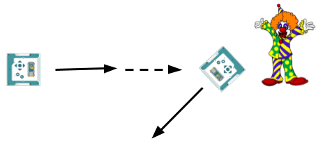

**In this project the robot patrols a room on its own, advances on whatever it finds, and either scares it off or loses its nerve and runs away.**

> {{SAVE}}

# Part 1: How it works

Read this part when you get stuck. It has the answer to almost every question you will have.

## What you are building

A security robot with four moods.

It patrols, on green lights, watching the room. Something turns up within two feet of it, and the lights go red and the robot advances on it — slowly, which is the menacing part. Then one of two things happens.

The evil clown backs off, and the robot goes back on patrol like nothing happened.

Or the evil clown does not back off. The robot closes right in, discovers it is a robot the size of a sandwich, turns away, and runs.



Almost every piece is already yours. The distance sensor is P04's. The lights are P02's. `drive()` is P05's, and `move()` and `rotate()` are P04's. What is new is that the robot now has four completely different behaviors, and something has to keep track of which one it is doing.

## The sentence your program cannot say yet

Start writing this the way you have written every project so far, with `if` statements about what the sensor says. The first line is easy:

```
if distance < 60:
    # advance on it
```

Now write the next rule. In plain English it is: **if it does not flee, turn and run.**

Try to turn that into an `if` about the distance. You cannot. There is no reading that means "did not flee." A reading is a number, taken right now — 40 cm. "Did not flee" is not about right now. It is about what happened *while the robot was advancing*, which is a stretch of time, and about what the robot was doing during it.

A program that only ever looks at this instant cannot say that sentence at all. It does not matter how clever your `if` is or how many you write.

So the robot needs to remember what it is in the middle of doing. That is the whole idea, and everything below is the plumbing.

## One reading, four answers

Here is the same thing from the other side. Take one reading — 40 cm — and ask what the robot should do about it:

- Patrolling? 40 is closer than 60, so something is there. Go and have a look.
- Advancing? 40 is between the two limits, so nothing has been settled yet. Keep closing in.
- Turning around to run? 40 means nothing. Ignore it.
- Running away? 40 means nothing. Ignore it, and keep running.

One number, four correct answers, and **nothing in the number tells you which answer is yours.** The reading is not enough. It never was.

What picks the right answer is what the robot was already doing. So the robot has to write that down somewhere, and the place it writes it down is called `current_state`.

## A variable that holds a word

Look near the top of your file:

```
PATROLLING = "PATROLLING"
ADVANCING = "ADVANCING"
TURNING = "TURNING"
RUNNING = "RUNNING"

current_state = PATROLLING
```

`current_state` is an ordinary variable, the same kind as `distance` or `seconds`. What is new is what it is for. It does not hold a measurement of anything. It holds **the name of what the robot is doing**, and every other line in the loop reads it before deciding anything.

The four lines above it look odd the first time. `PATROLLING = "PATROLLING"` gives the word a name, so you never type the word out again anywhere else. Do it that way and a typo is loud:

```
current_state = PATROLING       # one L. Python stops and says so.
current_state = "PATROLING"     # one L. Python is perfectly happy.
```

The second one is the dangerous kind. As far as Python is concerned that is a good word, so nothing is reported, and every branch you write quietly fails to match it. The robot carries on at whatever speed it was last given, saying nothing, and the fault looks like a broken robot rather than a typo.

You will build a catch-all for exactly that in WORK 1, so it can never happen to you silently.

## The shape of the machine

The whole loop is one chain:

```
if current_state == PATROLLING:
    # what a patrolling robot does

elif current_state == ADVANCING:
    # what an advancing robot does

elif current_state == TURNING:
    # and so on
```

You have been writing `if` and `elif` chains since P01. The new part is what this one asks about. Every chain you have written until now asked about the world — how far away, which button, how fast. This one asks about the robot.

Only one branch runs each time through the loop, which is exactly right. The robot cannot be patrolling and running away in the same moment.

## Actions and transitions

Inside a branch there are two kinds of line, and it is worth knowing which is which.

**Actions** are what the robot does while it is in that state — lights, wheels, screen. They run again every single time through the loop, and that is fine. Setting a green light green does no harm.

**Transitions** are the lines that change `current_state`. There are only ever one or two, and they belong at the **bottom** of the branch, underneath the actions.

They go at the bottom for a reason worth carrying with you. Changing `current_state` does nothing right now — the branch you are standing in has already run. It changes which branch runs the **next** time around the loop. A transition is a note to your future self, not a command.

## WORK 1: patrolling, and the catch-all

Green lights, forward, no turning, and one way out:

```
if current_state == PATROLLING:
    sb.light_both_leds(0, 1, 0)
    alvik.drive(PATROL_SPEED_CMS, 0)

    if distance < SPOT_CM:
        current_state = ADVANCING
```

`drive()` is P05's, and it takes two numbers: how fast to go forward, and how fast to turn. In P05 you used both at once to bend the path into a curve. Here you only ever want one of them at a time, so the other one is zero.

`SPOT_CM` is 60, which is the two feet from the mission. Anything closer than that is worth a look.

Now the other half of WORK 1, and it goes at the very end of the whole chain:

```
else:
    sb.light_both_leds(1, 0, 0)
    sb.log_info("Bad:", current_state)
    time.sleep_ms(3000)
    break
```

This is the **catch-all**. It runs when `current_state` holds a word that no branch above it matches — because you mistyped it, or because you have not written that branch yet. Without it, both of those are silent, and a silent robot does not mean a stopped one: `drive()` sets a speed that stays set, so it keeps doing the last thing it was told while your code decides nothing.

`sb.log_info()` prints to the Shell **and** writes the screen, so you get the message with or without the cable. `break` leaves the `while` loop, which runs the shutdown at the bottom of the file.

**Every new state you write goes above this else.** The else is always the last thing in the chain.

Run what you have. The robot patrols, spots you, sets `current_state` to `ADVANCING` — and stops with `Bad: ADVANCING` on the screen, because that branch does not exist yet. That is your catch-all working, and it is the last time this project will fail quietly.

## WORK 2: advancing, and the two ways out

```
elif current_state == ADVANCING:
    sb.light_both_leds(1, 0, 0)
    alvik.drive(ADVANCE_SPEED_CMS, 0)
```

Slower than the patrol, on purpose. A thing that comes at you slowly and will not stop is much worse than a thing that comes at you fast.

Now the interesting part. This is the first state you have written with **two** ways out, so its branch ends with two tests instead of one:

```
    if distance > FLED_CM:
        current_state = PATROLLING
    elif distance < STUBBORN_CM:
        current_state = TURNING
```

The advance is bracketed by those two numbers, and while the robot keeps rolling forward only two things can happen to the gap. It opens up, because the target backed away faster than the robot closed in — that is fleeing. Or it shuts, because the target never moved at all — that is not fleeing. There is no third case to write.

`FLED_CM` also catches the target that bolts out of the room entirely. With nothing in front of it, `sb.get_closest_distance()` reports 999, and 999 is comfortably past 90. The clown that strolls away and the clown that sprints away are the same test.

## Two states that watch, and two that do not

Look at what your first two states have in common. Both of them set a speed and then ask a question, over and over, twenty times a second. They are **watching** states. They have to be, because at any moment the answer could change and the robot has to notice.

The retreat is not like that. Once the robot has decided to run, there is nothing it could see that would change its mind. It is not watching for anything. It is just leaving.

So the retreat is allowed to use a different kind of command:

- `alvik.drive(speed, turn)` sets a speed and comes straight back, so your loop keeps running.
- `alvik.rotate(degrees)` turns that far, and does not come back until the turn is finished.
- `alvik.move(centimeters)` drives that far, and does not come back until the drive is finished.

`rotate()` and `move()` are the ones from P04, and they **block** — the robot is deaf and blind for the whole maneuver. P07 spent a page telling you never to do that, and it was right, because everything in P07 needed watching. Here, nothing does. Same fact about the same commands, opposite conclusion, and the thing that changed is the job.

That is why the last two branches are three lines long. There is no waiting to write, because the command does the waiting.

One thing you give up: `rotate()` and `move()` pick their own speed. You cannot tell the robot to run away *fast*. If you want to choose the speed, you have to go back to `drive()`, and then you have to write the watching yourself.

## WORK 3: turning and running

Two branches, both blue. Blue is the color of a robot that has changed its mind about being brave, and both retreat states share it — two different states are allowed to do the same thing, they just are not allowed to be the same state.

```
elif current_state == TURNING:
    sb.light_both_leds(0, 0, 1)
    alvik.rotate(RETREAT_TURN_DEG)
    current_state = RUNNING
```

```
elif current_state == RUNNING:
    sb.light_both_leds(0, 0, 1)
    alvik.move(RUN_CM)
    current_state = PATROLLING
```

That is the whole retreat. The robot turns 135 degrees, drives 50 cm, and is back on patrol somewhere else in the room, pointing somewhere new.

**135 degrees, and not 180.** Look at the picture on the first page again — the escape arrow is not straight back the way it came. Turning right around sounds like the obvious answer and it is a trap. A robot that always reverses its own path runs up and down the same line forever, and in a corner it bounces between the same two walls and never patrols the rest of the room. Turning a little less than half way breaks that pattern, so every retreat sends the robot somewhere it has not just been.

These two states are entered and left **on the same pass**. `rotate()` does not return until the turn is over, so the very next line runs with the turn already finished, and there is nothing left to wait for. A state does not have to last a long time. It only has to be a thing the robot is doing.

**Notice what these two states do not do.** Neither one looks at `distance`. The robot is running away; it does not care what is behind it and it is not going to change its mind. That is not laziness, it is the point — the same reading it acted on two seconds ago is now ignored entirely, and the only reason it can be ignored is that `current_state` says so.

# Part 2: Do the work

## Step 1: Set up

1. Turn on your Alvik robot and connect it to your Mac with the USB cable.
2. Open `p08_security_bot.py` in Thonny and save your own copy to the robot as described at the top of this guide. **Name the file** `p08.py`.
3. Run it before you type anything. The screen should read `Security: PATROLLING` and the robot should sit still.

The screen is given to you. It writes the state every time the state changes, so you can always see what the robot thinks it is doing. When something goes wrong later, look there first.

**Work on the floor, not on a desk.** This robot drives itself, and it does not know what a table edge is.

## Step 2: Type in WORK 1

Find the `# --- WORK 1` comment. Type this where the `pass` line is, then delete the `pass` line:

```
if current_state == PATROLLING:
    sb.light_both_leds(0, 1, 0)
    alvik.drive(PATROL_SPEED_CMS, 0)

    if distance < SPOT_CM:
        current_state = ADVANCING

else:
    sb.light_both_leds(1, 0, 0)
    sb.log_info("Bad:", current_state)
    time.sleep_ms(3000)
    break
```

Run it. Green lights, the robot drives forward, and when you put your foot in front of it the screen says `Bad: ADVANCING` and the robot stops. That is correct — you have not written that branch yet, and the catch-all told you so instead of letting the robot roll on.

## Step 3: Type in WORK 2

Between your WORK 1 branch and the `else`, lined up with the `if` from WORK 1:

```
elif current_state == ADVANCING:
    sb.light_both_leds(1, 0, 0)
    alvik.drive(ADVANCE_SPEED_CMS, 0)

    if distance > FLED_CM:
        current_state = PATROLLING
    elif distance < STUBBORN_CM:
        current_state = TURNING
```

Run it, and play the clown yourself.

Put your hand in its way and let it come at you. Back away slowly and it follows. Back away fast and it gives up and goes green. Stand your ground and it closes in — and stops, with `Bad: TURNING` on the screen. Same catch-all, one state further along.

## Step 4: Type in WORK 3

Both retreat branches, still above the `else`, still lined up with the `if` from WORK 1:

```
elif current_state == TURNING:
    sb.light_both_leds(0, 0, 1)
    alvik.rotate(RETREAT_TURN_DEG)
    current_state = RUNNING

elif current_state == RUNNING:
    sb.light_both_leds(0, 0, 1)
    alvik.move(RUN_CM)
    current_state = PATROLLING
```

Run it. Stand your ground, and watch it turn tail.

**If it runs away over and over without ever going back on patrol**, you have left out the last line of one of these two branches. A state with no way out is a trap, and the screen will tell you which one the robot is stuck in.

**If it stops with `Bad:` and a word you meant to write**, that word is spelled differently in two places. Look at the branch and the transition side by side.

## Step 5: Worksheet and check off

One run shows everything. Power the robot up with no cable, put it on the floor, and let it patrol. Step into its way and it comes for you. Back off well and it returns to patrol. Stand your ground and it turns and runs.

{{PARTA}}

{{GRADING}}

## FLEX: The A+

This one is not printed anywhere. You work it out.

Your robot runs away and never finds out whether it was chased. It just turns up at the other end of the room and starts patrolling again, which is either very brave or not very bright.

Add a fifth state. Call it `PEEKING`. After the run, the robot turns back around and looks the way it came. If something is there, it runs again. If not, it goes back on patrol.

Three things to think about:

- `RUNNING` currently ends by going back to patrol. It will not any more.
- `RETREAT_TURN_DEG` is the wrong angle for this turn. Work out which angle points the robot back down the path it just ran, and give it its own name at the top of the file.
- `rotate()` blocks, so the reading your loop took at the top of the pass was taken *before* the robot turned round. It is out of date by a whole half turn. You will need a fresh one.
- Draw your five states on paper with arrows between them. This new state has two arrows out, and one of them points at a state the robot has already been through. That is not a mistake — machines are allowed to go backwards.
