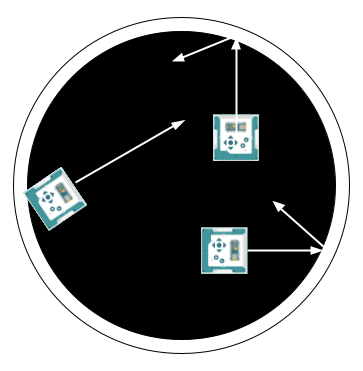

**In this project you build a robot that fights. It patrols the ring, backs off the edge before it falls out, and charges anything that gets in front of it.**

> {{SAVE}}

# Part 1: How it works

Read this part when you get stuck. It has the answer to almost every question you will have.

## What you are building

The ring has a black floor and a white rim. Robots drive around inside it looking for each other. Reach the white and you back off and go somewhere else. Find another robot right in front of you and you put everything you have into shoving it out.



## This one is different

Every project so far has printed the lines you needed. This one does not.

Everything this robot does, you have already built. The guide shows you **the code you wrote to solve the same problem in an earlier project**, and your job is to work out what has to change. Sometimes that is a number. Sometimes it is a word. Once it is where a line goes.

Your old files are still on your robot, so you can open them and take the real thing rather than copy it off this page.

Two pieces are given to you at the top of `p09_sumo_bot.py`, because they are plumbing and not the point:

- `edge_detected()` is true when a line sensor has reached the white rim. You never touch the line sensors in this project.
- `waiting_for_gamepad()` holds the robot still until you press CROSS. Nothing in the match reads the gamepad after that, so a flat controller can cost you a start but never a bout.

## What the robot has to do, and where you already did it

- Drive at a set speed — **P03**, where the wheels took RPM straight from the sticks.
- Watch how far away something is, and act at a threshold — **P04** and **P07**.
- Back up and turn, without watching anything while it happens — **P04**, and again in **P08**.
- Pick something at random — **P06**.
- Run three different behaviors from one variable — **P08**, the whole machine.
- Say which behavior is running, in a color — **P08**.

One thing on this robot has no ancestor at all, and it is the only genuinely new idea in the project.

## The new idea: a test that outranks the tree

In P08 every transition lived inside a branch, and you learned that it takes effect on the *next* pass of the loop. A transition is a note to your future self.

The edge cannot wait for the next pass, and it cannot live inside a branch either — a robot must back off the rim whether it was patrolling *or* charging, and copying the same test into every branch is how machines rot.

So it goes **above the tree**, before the first `if`:

- It runs before any branch is chosen.
- It writes `current_state` while the tree is still ahead of it, so the tree sees the new value and the turning branch runs on **this** pass.
- It beats every branch below it, because it already happened.

That is a **guard**, and it is a different animal from a transition. The whole reason to put it up there is the thing P08 told you transitions do not do.

It changes one thing you were given. The line that writes the state on the screen sits **below** where your guard goes, and that is deliberate — a guard sets `TURNING` and the turning branch clears it again on the same pass, so a screen written above the guard would never once show it. Your robot would spend a second and a half backing off the rim with `PATROLLING` on its face.

## Why the guard has to beat the charge

The rim is about three inches, 7.6 cm. At patrol speed that is roughly nine tenths of a second between touching white and falling out, and your loop runs twenty times a second. Enormous margin.

At attack speed that margin shrinks by a third — and attack speed is exactly when your robot is least interested in what is under it. The faster the robot, the more the edge has to be checked first.

It buys you something you would otherwise have to write. Shove an opponent over the rim and **you** are now standing on the rim. The guard fires before your attack branch runs, so you back off instead of following your victim out. Nobody has to write "do not win yourself out of the ring." It falls out of the guard being first.

# Part 2: Do the work

## Step 1: Set up

1. Turn on your Alvik robot and connect it to your Mac with the USB cable.
2. Open `p09_sumo_bot.py` in Thonny and save your own copy to the robot as described at the top of this guide. **Name the file** `p09.py`.
3. Run it. The lights blink yellow while your controller finds the robot, then green while it waits for CROSS. Press CROSS and nothing happens, because you have not written anything yet.

## Step 2: WORK 1 — patrolling

Here is your P08 security bot, patrolling:

```
if current_state == PATROLLING:
    sb.light_both_leds(0, 1, 0)
    alvik.drive(PATROL_SPEED_CMS, 0)

    if distance < SPOT_CM:
        current_state = ADVANCING
```

Three of those four lines survive almost unchanged. The one that does not is the wheels.

The sumo speeds are in **RPM**, not centimeters per second, and `drive()` does not take RPM. You have written the line that does — in P03, where the sticks fed the wheels directly:

```
alvik.set_wheels_speed(left_speed, right_speed)
```

Two wheels, two numbers. Give both wheels the same number and the robot goes straight. `PATROL_RPM` is at the top of your file.

Then the catch-all, which you copy from P08 and do not change at all. It goes at the very end of the whole chain, and you want it before your first run:

```
else:
    sb.light_both_leds(1, 0, 0)
    sb.log_info("Bad:", current_state)
    time.sleep_ms(3000)
    break
```

Run it on the ring floor, away from the rim, and it drives in a straight line. Catch it before the white — nothing stops it yet.

## Step 3: WORK 2 — the guard and the turn

Two pieces, and the first is two lines.

**The guard.** Above the tree, before your `if current_state == PATROLLING`. Ask `edge_detected()`, and if it is true, set `current_state` to `TURNING`. That is the whole thing. Read *The new idea* again if you are not sure why it cannot go inside a branch.

**The turn.** Here is P08's retreat, which was two states:

```
elif current_state == TURNING:
    sb.light_both_leds(0, 0, 1)
    alvik.rotate(RETREAT_TURN_DEG)
    current_state = RUNNING

elif current_state == RUNNING:
    sb.light_both_leds(0, 0, 1)
    alvik.move(RUN_CM)
    current_state = PATROLLING
```

Yours is one state that does both jobs, and three things about it are different.

- **The order is the other way round.** P08 turned and then ran. You are on the edge of a cliff, so you back off first and turn afterwards.
- **The distance is negative.** `move()` takes a distance, and a negative one goes backwards. `BACKUP_CM` is at the top of your file, and it is bigger than it looks it needs to be — your nose has already crept over the white by the time the guard fires, and if you turn with a sensor still on the rim you will guard again immediately and never get anywhere.
- **How far you turn is yours.** Nobody is giving you that number. A quarter turn tends to run you along the rim and straight back into it. Something near a half turn sends you back through the middle, where the other robots are.

Both `move()` and `rotate()` block — the robot is deaf until they finish. In P08 that was safe because nothing mattered during a retreat, and it is safe here for the same reason. You have decided to leave. Nothing you could see would change your mind.

If you want your robot to be unpredictable, P06 has the tool. It picked the ring's hiding place with:

```
away = random.uniform(self.MIN_DIST_CM, max_dist)
```

`random` is already imported in your file.

Run it in the ring. It patrols, reaches the white, backs off, turns, and carries on. It should now be able to stay in the ring by itself for as long as you leave it.

## Step 4: WORK 3 — attacking

Here is P08 again, advancing on the clown:

```
elif current_state == ADVANCING:
    sb.light_both_leds(1, 0, 0)
    alvik.drive(ADVANCE_SPEED_CMS, 0)

    if distance > FLED_CM:
        current_state = PATROLLING
    elif distance < STUBBORN_CM:
        current_state = TURNING
```

Yours is simpler, not harder. Same light. Wheels from P03 again, at `ATTACK_RPM`. And it needs only **one** way out, not two — the other one is already covered by something you wrote in Step 3, and working out which is the point of this step.

`ATTACK_CM` is 3, and that number is not round by accident. The ring floor throws false readings back at the distance sensor from about 5 cm out, so the charge is set underneath the lies.

Run it. Put something in front of the robot and it should go from green and steady to red and fast.

## Step 5: Worksheet and check off

One run shows everything. Power the robot up with no cable, put it in the ring, press CROSS. It patrols, it turns away from the white every time, and it charges anything you hold in front of it.

{{PARTA}}

{{GRADING}}

## What these three states do not solve

Two robots meet head-on. Both see something inside 3 cm. Both charge. Neither moves.

Nothing you have written breaks that, and it is the most likely thing that will happen to you in a real match. Watch for it in testing: two robots, both red, both still.

You are allowed more states than the three you were given.

## FLEX: The A+

Finish on the podium.
